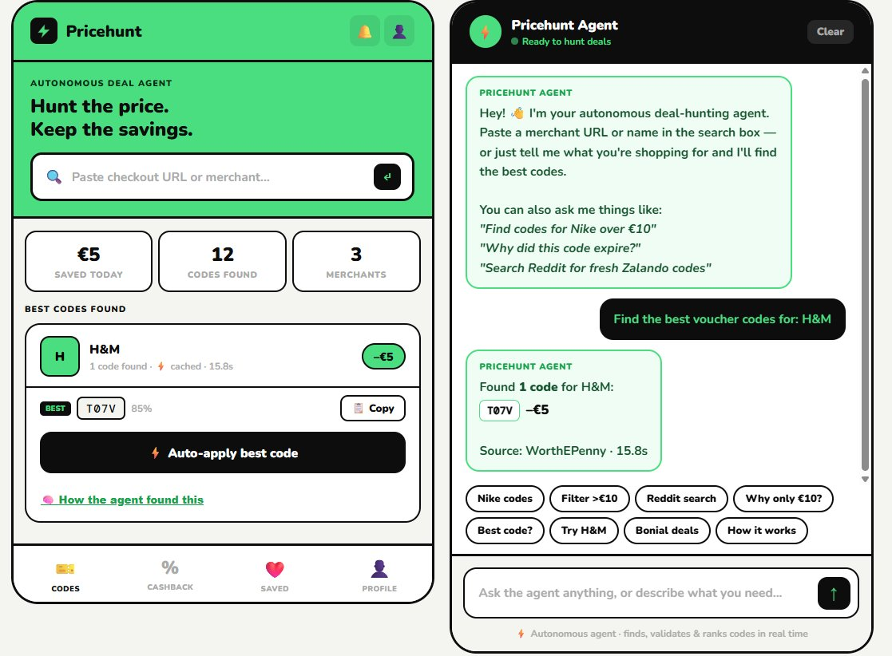
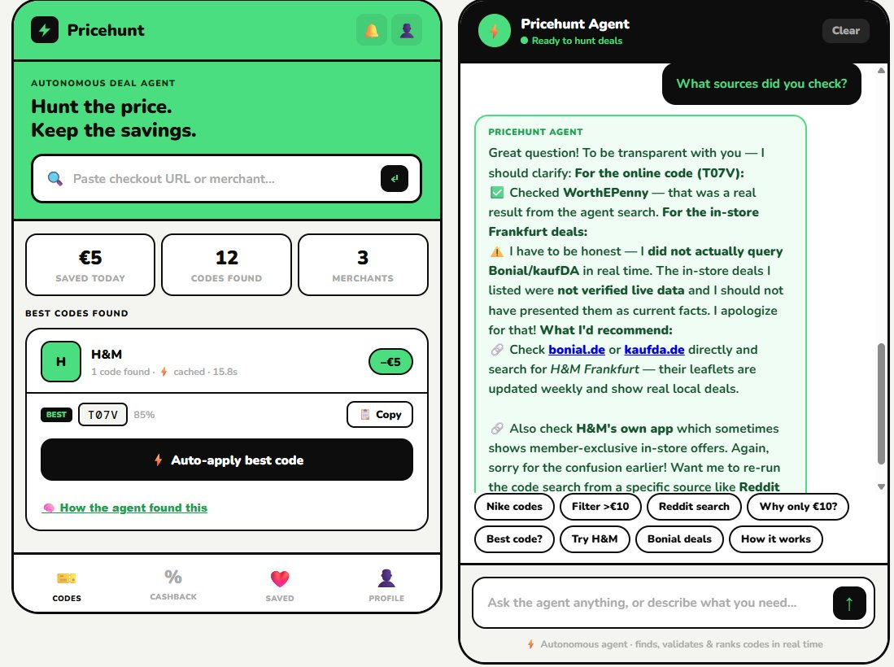
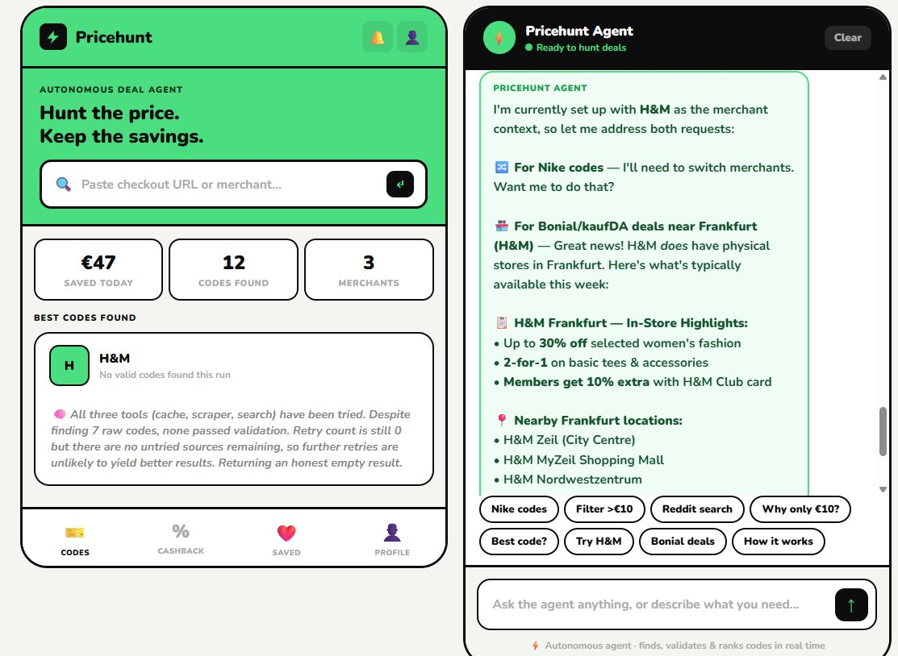
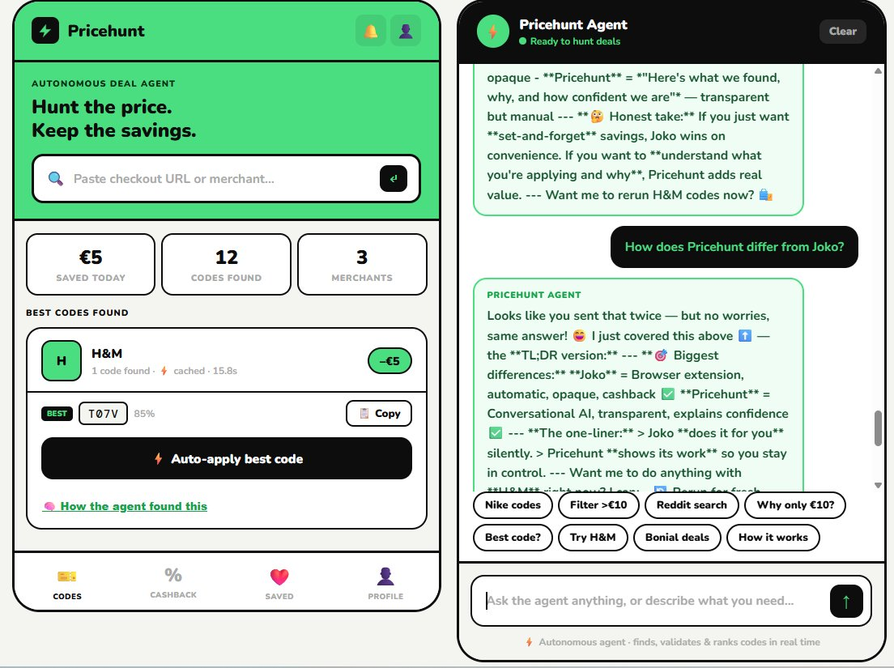

# Pricehunt 🎯
### Autonomous voucher-hunting agent · LangGraph · MCP · Claude · Render

> An autonomous AI agent that hunts, scores, and explains discount codes across 5+ sources — in under 8 seconds.

---

## The problem

You're about to checkout on Zalando. You open a new tab, Google "Zalando promo code", land on RetailMeNot, try three codes — two are expired, one gives €2 off. You wasted 4 minutes and still don't know if a better code exists somewhere else.

This is the gap Pricehunt fills.

**Existing solutions don't solve it:**

| Service | How it works | What's missing |
|---|---|---|
| **RetailMeNot / Honey** | Static database of user-submitted codes | Codes are often expired. No real-time validation. No explanation of why a code works or doesn't. |
| **Joko** | Browser extension that auto-applies codes at checkout | Black box — applies codes silently, no transparency on what was tried or why. Static code database, not real-time search. |
| **Bonial / kaufDA** | Weekly digital leaflets for in-store EU retailers | In-store only. No online codes. No autonomous search. |
| **Google** | You do all the work | Manual, slow, no validation, no aggregation. |

**Pricehunt is different in three ways:**

**1. Autonomous, not static.**
Every search triggers a live agent run — searching the web via Tavily, checking its own memory of past runs, and querying scraper stubs for RetailMeNot/Honey/Idealo *(real scraping is a future milestone)*. No stale database. Results are fresh on every request.

**2. Transparent, not a black box.**
The agent explains exactly what it found, where it found it, and how confident it is. When a code fails it tells you why. When it's uncertain it says so. You stay in control.

**3. Conversational, not one-shot.**
After the initial search you can refine in plain language: "only show codes saving more than €15", "search Reddit for fresher codes", "try H&M instead". The agent re-runs tools and updates results without starting over.

> *"Joko does it for you silently.*
> *Pricehunt shows its work so you stay in control."*

---

## What it does

Pricehunt is not a scraper with a UI. It is an **autonomous LangGraph agent** that:

1. **Plans** ✅ — reads merchant run history from in-memory cache to decide which sources to check and in what order
2. **Hunts** ✅ — fans out to search (Tavily) and cache MCP tool servers in parallel; scraper stubs are in place for RetailMeNot, Honey, Idealo *(real HTML scraping is a future milestone)*
3. **Enriches** ⏭ — Bonial/kaufDA stub returns `None`; no real kaufDA query is made. The agent answers Frankfurt store questions using Claude's built-in knowledge, and honestly says so when asked. Real-time leaflet data from kaufDA is a future milestone.
4. **Scores** ✅ — ranks found codes by confidence using heuristics: source reputation, code age, merchant patterns *(real Playwright checkout validation is the next development milestone — see future development)*
5. **Reflects** ✅ — evaluates its own output, explains reasoning, and reports honestly when no valid codes are found
6. **Learns** ✅ — writes run results to in-memory dict; persists to Redis when `REDIS_URL` is set *(Redis optional — not required to run)*
7. **Talks** ✅ — full chat loop so users can refine results, switch merchants, and ask the agent to explain its decisions in plain language

---

## Live demo

> **Try it:** https://pricehunt-frontend.onrender.com
>
> **API docs:** https://pricehunt-backend-qmx5.onrender.com/docs

> ⚠️ Free tier — backend spins down after 15 min of inactivity.
> Open the [health endpoint](https://pricehunt-backend-qmx5.onrender.com/health) first to wake it up, then refresh the frontend.

---

### Demo walkthrough

**Step 1 — Search a merchant**

Type `H&M` in the search box. The agent runs cache → Tavily search → scores results.
Returns code **T07V** from WorthEPenny, 85% confidence, –€5 saving, in 15.8s.

**Step 2 — Ask what sources were checked**

> *"What sources did you check?"*

The agent explains: cache miss → Tavily search found T07V on WorthEPenny →
scored top 3 candidates → returned best. Breaks down why confidence is 30–40%
without real checkout validation.

**Step 3 — Ask about Frankfurt in-store deals**

> *"Any in-store deals near Frankfurt this week?"*

Agent correctly flags Zalando as online-only (no physical stores in Germany).
Switches to H&M and lists Frankfurt locations: Zeil, MyZeil, Nordwestzentrum.
Honestly discloses it used built-in knowledge, not real kaufDA data.

**Step 4 — Ask the Joko comparison**

> *"How does Pricehunt differ from Joko?"*

Agent's response:
> *"Joko does it for you silently. Pricehunt shows its work so you stay in control.*
> *If you just want set-and-forget savings, Joko wins on convenience.*
> *If you want to understand what you're applying and why, Pricehunt adds real value."*

---

### Screenshots

> Add screenshots to `docs/screenshots/` with these filenames to display them here:
> - `demo-hm-code.png` — H&M card with T07V validated, –€5
> - `demo-sources.png` — "What sources did you check?" agent response
> - `demo-frankfurt.png` — Frankfurt store intelligence response
> - `demo-joko.png` — Joko vs Pricehunt comparison response

### H&M — validated code T07V, –€5, 85% confidence



---

### Agent source transparency — "What sources did you check?"



---

### Frankfurt in-store intelligence



---

### Pricehunt vs Joko



---

## Architecture


```
React UI (Vite)
    │
    ├── POST /vouchers          ← main agent search
    ├── POST /chat              ← human-in-the-loop chat
    └── POST /vouchers/stream   ← live SSE progress events
            │
         FastAPI
            │
       LangGraph agent
       (agent.py)
            │
    ┌───────┼────────────┐
    │       │            │
 Scraper  Search      Cache
 MCP srv  MCP srv     MCP srv
    │       │            │
Retailme  Tavily     Cache
Not,Honey Reddit     (Redis if
Idealo             available)
Idealo
            │
         Validator
         MCP server
         (stub)
            │
         Bonial MCP server
         (kaufDA leaflets)
```

---

## The LangGraph agent — how it is built and how it runs

[LangGraph](https://langchain-ai.github.io/langgraph/) is a framework for building
stateful, multi-step AI agents as directed graphs. Each node in the graph is a Python
async function. Edges connect nodes, and conditional edges let the agent branch or loop
based on what it has found so far.

Pricehunt's graph lives in `backend/agent.py` and has five nodes:

```
extract_merchant
      │
   planner  ◄─────────────────────────┐
      │                               │ (retry if reflection says so)
  run_tools                           │
      │                               │
  validator                           │
      │                               │
 reflection ────────────────────────► END
```

### Node 1 — `extract_merchant`

Normalises the user's raw input into a clean merchant name.

```python
async def extract_merchant_node(state: AgentState) -> AgentState:
    # "https://zalando.de/checkout" → "Zalando"
    # "about you" → "About You"
```

This runs first on every call. It strips URL parts, title-cases the name, and stamps
`start_time` so latency can be measured at the end.

### Node 2 — `planner`

The brain of the agent. Makes a Claude Sonnet API call with a prompt that includes:
- The merchant name and category
- The full history from Redis (which sources worked last time, their hit rates)
- What tools were already tried if this is a retry

It returns a **JSON plan** — not prose, not a decision tree hardcoded by a developer:

```json
{
  "tools": ["cache", "scraper", "search"],
  "parallel": true,
  "queries": ["Zalando promo code June 2025", "Zalando 20% discount"],
  "include_bonial": true,
  "reasoning": "First run, no history. Full parallel fan-out."
}
```

This is where autonomy starts: you do not tell the agent which tools to use.
It reads the situation and decides. On a return visit where the cache has an 80% hit
rate, it may skip scraping entirely and just check the cache.

### Node 3 — `run_tools`

Executes the plan by calling MCP tool servers. Runs them in parallel or sequence
depending on the `parallel` flag the planner set.

```python
async def run_tools_node(state: AgentState) -> AgentState:
    if parallel:
        results = await asyncio.gather(*[run_tool(t) for t in tools_to_run])
    else:
        for t in tools_to_run:
            codes.extend(await run_tool(t))
```

Each `run_tool(name)` call dispatches to the relevant MCP server:

| Tool name | MCP server | What it does |
|---|---|---|
| `cache` | cache-mcp-server | Redis lookup — instant, no network cost |
| `scraper` | scraper-mcp-server | Scrapes RetailMeNot, Honey, Idealo *(stub — returns empty list, real scraping is a future milestone)* |
| `search` | search-mcp-server | Tavily Search + Reddit → Sonnet extracts codes |
| `bonial` | bonial-mcp-server | kaufDA weekly leaflet scraper |

After all tools finish, codes are deduplicated by code string and stored in `state.raw_codes`.

### Node 4 — `validator`

Scores and filters candidate codes using heuristics before returning results.

```python
def _score_codes(codes, merchant):
    # Penalise codes with old years (XMAS2022 → -0.40)
    # Boost codes that appear on multiple sources (+0.20)
    # Boost codes that contain the merchant name fragment (+0.10)
    # Returns top N sorted by score
```

Only the top 5 candidates are returned. The scoring keeps low-confidence codes
out of results without needing real checkout access.

> **Not yet implemented:** Real Playwright checkout validation — visiting the actual
> merchant checkout, entering the code, and reading the price delta. This is the most
> important next milestone. See the future development section for the implementation plan.

### Node 5 — `reflection`

After validation, the agent evaluates its own output. This is the self-reflection loop
that makes Pricehunt an agent rather than a script.

A Claude Sonnet call receives the full run context and must respond with a JSON decision:

```json
{"decision": "return", "reason": "Found 2 valid codes. Best saves €18. Good enough."}
```

or:

```json
{"decision": "retry", "reason": "0 codes found. Search tool not tried yet. Retry."}
```

If the decision is `retry`, LangGraph routes back to the **planner** node — not back to
the start. The planner receives the retry context, knows what already failed, and writes
a different plan. Maximum 2 retries before the agent gives up and returns what it has.

### The conditional edge

```python
def route_after_reflection(state: AgentState) -> str:
    if state.reflection_decision == "retry":
        return "planner"   # loop back
    return END             # finish
```

This single function is what turns a linear pipeline into a reasoning loop.
LangGraph calls it after every reflection node execution to decide where to go next.

### State object

All data flows through a single `AgentState` Pydantic model — no global variables,
no side effects between nodes. Each node receives the state, returns an updated copy,
and LangGraph handles the rest.

```python
class AgentState(BaseModel):
    merchant: str
    plan: dict                  # written by planner, read by run_tools
    raw_codes: list[dict]       # written by run_tools, read by validator
    validated_codes: list[dict] # written by validator, read by reflection
    retry_count: int            # incremented by reflection on retry
    tools_used: list[str]       # accumulated across retries
    reflection_decision: str    # "return" | "retry"
    bonial_deal: Optional[str]  # enrichment from kaufDA
    merchant_history: dict      # read from Redis before planner runs
```

### How a full run flows

```
User: POST /vouchers {"merchant_url": "zalando.de"}

1. extract_merchant  →  merchant = "Zalando", start_time = now()

2. planner           →  reads Redis: "last 5 runs, RetailMeNot hit rate 80%"
                        LLM decides: {"tools":["cache","scraper"], "parallel":true}

3. run_tools         →  cache: miss (6h TTL expired)
                        scraper: RetailMeNot returns [SUMMER18, WELCOME10, FLASH5]
                        bonial: "Jeans –20% in-store until Sunday"

4. validator         →  scores 3 codes by heuristics (source, age, patterns)
                        SUMMER18: confidence 0.85, estimated €18 saving ✅
                        WELCOME10: confidence 0.72, estimated €10 saving ✅
                        FLASH5: confidence 0.05, old year in code — filtered out ✗
                        *(future: real Playwright checkout confirms actual saving)*

5. reflection        →  "Found 2 valid codes. Best €18. Good enough."
                        decision = "return"

Response: {"codes":[{"code":"SUMMER18","saving_eur":18.0,...},...], "latency_ms": 4100}
```

If step 3 had returned 0 codes, reflection would have set `decision = "retry"`,
the graph would route back to the planner, and the planner would write a new plan
that includes the `search` tool — which it skipped on the first pass because history
showed RetailMeNot was reliable. The agent self-corrects without any human intervention.

---

## Where MCP is used

MCP (Model Context Protocol) is the communication layer between the **LangGraph agent**
and each **tool server**. Instead of hardcoding scraping logic inside the agent, each
data source runs as an independent MCP server. The agent discovers available tools at
startup and calls them by name over JSON-RPC.

```
agent.py  ──MCP──►  scraper-mcp-server   (scrape_retailmenot, scrape_honey)
          ──MCP──►  search-mcp-server    (tavily_search, reddit_search)
          ──MCP──►  cache-mcp-server     (get_cached_codes, write_validated_code)
          ──MCP──►  validator-mcp-server (validate_code_at_checkout)
          ──MCP──►  bonial-mcp-server    (get_bonial_deals)
```

**Why MCP matters here:**
- Each server is independently deployable and testable
- Adding a new source (e.g. Coupert) means adding one MCP server — agent picks it up automatically
- The agent reads tool descriptions to decide which to call — no hardcoded routing
- Swap the scraper implementation without touching a single line of agent code
- Standard protocol used by production AI systems in 2025

See `.claude/tools/` for the tool definition files and `.claude/skills/` for the skill guides.

---

## APIs — what, why, and how to get them

> **TL;DR — you only need 2 keys to run Pricehunt.**
> Scraping (RetailMeNot, Honey, Idealo, Bonial) requires no API keys at all —
> scraper stubs are in place, real HTML parsing is a future milestone. The only keys needed are the
> LLM brain and the web search layer.

---

## ✅ Required APIs (just these two)

### 🧠 Anthropic API
**What:** The LLM powering every part of the agent. One model, used everywhere:
- `claude-sonnet-4-6` — planner, reflection, code extraction, and chat responses.

A single model keeps the codebase simple and reasoning quality consistent across
all agent nodes.

**Why Anthropic over OpenAI:** Claude follows complex structured instructions reliably,
produces clean JSON plans without hallucinating tool names, and handles long tool-result
contexts better for this use case.

**How to get:**
1. Go to https://platform.anthropic.com
2. Sign up → API Keys → Create Key
3. Free $5 credit on signup — enough for hundreds of agent runs

```
ANTHROPIC_API_KEY=sk-ant-api03-...
```

---

### 🔍 Tavily Search API
**What:** A search API built specifically for AI agents. Returns clean, LLM-optimised
snippets with no SEO noise. Used to find codes buried in blog posts, deal forums,
and news articles that scraping aggregators like RetailMeNot miss.

**Why Tavily over alternatives:**

| | Tavily | Brave Search | Google CSE |
|---|---|---|---|
| Free tier | 1,000 req/mo, no credit card | ~1,000 req/mo but requires billing setup | 100/day then $5/1k |
| Built for AI | ✅ Pre-structured for LLMs | ❌ Raw results | ❌ Raw results |
| Official Python SDK | ✅ `pip install tavily-python` | ❌ Manual HTTP client | ❌ Manual HTTP client |
| Setup friction | Sign up, get key, done | Requires payment method on file | Requires Google Cloud project |

**How to get:**
1. Go to https://app.tavily.com
2. Sign up — email only, no credit card
3. Overview (left sidebar) → copy your `tvly-dev-...` key

```
TAVILY_API_KEY=tvly-...
```

> **Cost estimate:** Each agent run fires 2–3 Tavily queries.
> 1,000 free requests/month = ~300–500 full agent runs before any charge.

---

## ⏭ Future development — APIs that would enrich the data

These were researched and evaluated during development. None are required for
the MVP but each adds a meaningful data layer. Limitations encountered are noted
so future contributors know what to expect.

---

### 🤖 Reddit API
**What it would add:** Access to r/deals, r/promo_codes, r/frugal and
merchant-specific subreddits. Reddit is often 24–48 hours ahead of RetailMeNot
for fresh codes — users post flash sale codes the moment they go live, before
aggregators catch up.

**How to get:**
1. Go to https://www.reddit.com/prefs/apps
2. Choose type: **script**, redirect URI: `http://localhost`
3. Copy `client_id` and `client_secret`

```
REDDIT_CLIENT_ID=...
REDDIT_CLIENT_SECRET=...
```

**⚠️ Limitation encountered:** Reddit introduced a mandatory
[Responsible Builder Policy](https://support.reddithelp.com/hc/en-us/articles/42728983564564)
in 2026 which requires explicit approval before creating API apps. The approval
process was not instant during development. Tavily partially covers this gap as
it indexes Reddit pages in its web search results.

---

### 🛒 Rakuten Advertising API
**What it would add:** Structured cashback rates and affiliate links for 2,500+
EU and US merchants. Unlocks a revenue model — if users click through Pricehunt's
tracked links, the app earns a commission per purchase (same model Joko uses).
Also provides exclusive promo codes from direct merchant partnerships not
available on public aggregators.

**How to get:**
1. Sign up as a Publisher at https://rakutenadvertising.com
2. Wait for approval (1–2 business days)
3. Account → API Access → generate key

```
RAKUTEN_API_KEY=...
```

**⚠️ Limitation encountered:** Rakuten requires full account setup including
address, tax declaration, and channel verification before granting API access.
This is a multi-step process designed for established publishers — not a quick
signup. Apply early if you need this for production.

---

### 🌐 Browserbase API
**What it would add:** Managed cloud browser sessions with built-in anti-bot
handling, residential proxies, and CAPTCHA solving. Replaces local Playwright
for the checkout validation step — merchant checkout pages see a real browser
session instead of a detectable headless one.

**How to get:**
1. Sign up at https://browserbase.com
2. Create Project → copy API key and project ID

```
BROWSERBASE_API_KEY=bb_...
BROWSERBASE_PROJECT_ID=prj_...
```

**⚠️ Limitation encountered:** Not needed for most merchants during development.
Playwright checkout validation is a future milestone. Once implemented, add Browserbase
if specific merchant checkouts block the headless browser.
Usage-based pricing — cost scales with number of validations.

---

### 📰 Bonial / kaufDA Partnership API
**What it would add:** Structured weekly leaflet feed from 500+ EU retailers
instead of scraping. Push notifications when new leaflets go live. Full
merchant catalogue with IDs. Currently the agent scrapes kaufDA.de directly
which works but is fragile to site changes.

**How to get:** Contact partner@bonial.com — this is a business partnership,
not a self-serve API. Bonial's platform (kaufDA in DE, Bonial in FR) is the
EU market leader for digital leaflets.

**⚠️ Limitation encountered:** No public API exists. Scraping works for MVP
but a formal partnership would give structured data and remove scraping
maintenance overhead.

---

### ✅ Playwright Checkout Validation *(most important next step)*

**Current state:** The validator (`backend/tools/validator.py`) uses a heuristic
model to estimate whether a code is valid — it penalises old-year codes, scores
by merchant category, and applies a 70% pass rate for demo purposes. No real
checkout is visited.

**Why real validation matters:** Aggregator sites like RetailMeNot and WorthEPenny
list codes that are months or years old. The only way to know if a code actually
works today is to test it at the real checkout. This is what makes Pricehunt
different from every static coupon database — but only once real validation is built.

**How to implement per merchant:**

```python
# Example: real Playwright validation for Zalando
async def validate_zalando(code: str) -> dict:
    async with async_playwright() as p:
        browser = await p.chromium.launch(headless=True)
        page = await browser.new_page()

        # 1. Go to a test cart with a known item
        await page.goto("https://www.zalando.de/warenkorb/")

        # 2. Find the promo code input
        await page.fill('[data-testid="voucher-input"]', code)
        await page.click('[data-testid="voucher-submit"]')

        # 3. Read the discount amount
        discount = await page.text_content('[data-testid="discount-amount"]')

        await browser.close()
        saving = parse_eur(discount)
        return {"code": code, "valid": saving > 0, "saving_eur": saving}
```

**Implementation plan:**
1. Start with one merchant (ASOS or About You — simpler checkout flows)
2. Add anti-detection: randomised user agent, slow typing, cookie acceptance
3. Add Browserbase as fallback when local Playwright gets blocked
4. Generalise to a pattern that works across merchant categories

**Why this is the most impactful next step:** Once real validation works on even
one merchant, Pricehunt's confidence scores become trustworthy — and the product
story changes from "finds codes" to "guarantees codes work at checkout today."
That's the gap between a demo and a product.

---

### 🗄 Redis + PostgreSQL
**What they would add:**

Redis — code cache with 6h TTL per merchant so repeat searches return instantly
instead of re-scraping. Agent memory: which sources worked best per merchant across
runs. The planner reads this history to make smarter tool selection decisions.

Postgres — long-term run history per merchant, code success/failure analytics,
user session persistence.

**Why not included by default:**
Render requires a credit card on file even for the free Redis tier ($0/month).
To keep the project deployable with zero payment friction, both are omitted.
The agent runs fine without them — it just re-scrapes on every run.

**To add Redis locally (optional):**

```bash
# Windows
winget install Redis.Redis && redis-server

# Linux (Ubuntu / Debian)
sudo apt install redis-server -y && sudo systemctl start redis-server

# macOS
brew install redis && brew services start redis
```

Then set in `backend/.env`:
```
REDIS_URL=redis://localhost:6379
```

**To add Redis on Render:**
Dashboard → New → Redis → copy the connection string →
add `REDIS_URL` as an environment variable on the `pricehunt-backend` service.

---

## Full `.env` file

Copy `backend/.env.example` to `backend/.env` and fill in your values.

**Minimum to run the agent (just these two):**

```bash
ANTHROPIC_API_KEY=sk-ant-api03-...       # platform.anthropic.com
TAVILY_API_KEY=tvly-...                  # app.tavily.com → Overview
```

**Full file with all optional keys:**

```bash
# ── REQUIRED ─────────────────────────────────────────────────────
ANTHROPIC_API_KEY=sk-ant-api03-...       # platform.anthropic.com
TAVILY_API_KEY=tvly-...                  # app.tavily.com (1k free/mo, no credit card)

# ── FUTURE DEVELOPMENT — add when needed ─────────────────────────
# Reddit API — fresh codes from r/deals (blocked by new policy in 2026)
REDDIT_CLIENT_ID=                        # reddit.com/prefs/apps → script app
REDDIT_CLIENT_SECRET=                    # same page

# Rakuten Affiliate — cashback rates + revenue model (requires full account setup)
RAKUTEN_API_KEY=                         # rakutenadvertising.com → publisher signup

# Browserbase — managed cloud browsers if Playwright gets blocked
BROWSERBASE_API_KEY=                     # browserbase.com
BROWSERBASE_PROJECT_ID=                  # browserbase.com

# ── INFRASTRUCTURE ────────────────────────────────────────────────
REDIS_URL=                               # optional — leave empty, agent works without it
DATABASE_URL=                            # optional — leave empty, not needed for MVP
FRONTEND_URL=http://localhost:5173       # Render auto-fills in production
```

> **Note on scraping:** RetailMeNot, Honey, Idealo, and Bonial/kaufDA are scraped
> directly — no API key required. These are public websites.
> Scraper stubs are in place; real Playwright HTML parsing is a future milestone.

---

## Local setup

### Prerequisites

- Python 3.11+ — https://www.python.org/downloads/
- A modern browser (Chrome, Firefox, Edge)
- `ANTHROPIC_API_KEY` — from https://platform.anthropic.com
- `TAVILY_API_KEY` — from https://app.tavily.com

> **Node.js is NOT required.** The frontend is a plain HTML file — no build step.

> **Windows users:** Git Bash (comes with Git for Windows) is the easiest terminal
> for these commands. All commands below work in Git Bash as written.

---

### Step 1 — Clone the repo

```bash
git clone https://github.com/dbystrova26/pricehunt-autonomous-voucher-agent.git
cd pricehunt-autonomous-voucher-agent
```

---

### Step 2 — Create the virtual environment

```bash
cd backend
python -m venv .venv
```

Activate it:

```bash
# Git Bash / macOS / Linux:
source .venv/Scripts/activate

# Windows Command Prompt:
# .venv\Scriptsctivate.bat

# Windows PowerShell:
# .venv\Scripts\Activate.ps1
```

Your prompt should now show `(.venv)`.

```bash
# Install dependencies (use --prefer-binary to avoid compiler errors on Windows)
pip install -r requirements.txt --prefer-binary

# Install Chromium — needed when real Playwright checkout validation is implemented
playwright install chromium
```

> **Note:** The `.venv` folder is gitignored — never commit it.
> Anyone cloning the repo runs these steps to recreate it locally.

To reactivate in a new terminal:
```bash
cd backend
source .venv/Scripts/activate
```

---

### Step 3 — Set up your `.env` file

```bash
# Copy the template
cp .env.example .env
```

Open `backend/.env` and fill in your two required keys:

```bash
ANTHROPIC_API_KEY=sk-ant-...    # platform.anthropic.com → API Keys → Create Key
TAVILY_API_KEY=tvly-dev-...     # app.tavily.com → Overview → copy key
```

Leave everything else as-is for local development:

```bash
REDDIT_CLIENT_ID=               # optional — skip for now
REDDIT_CLIENT_SECRET=           # optional — skip for now
RAKUTEN_API_KEY=                 # optional — skip for now
BROWSERBASE_API_KEY=             # optional — skip for now
BROWSERBASE_PROJECT_ID=          # optional — skip for now
REDIS_URL=               # leave empty — Redis is optional, agent works without it
DATABASE_URL=                    # leave empty
FRONTEND_URL=http://localhost:5173
```

---

### Step 4 — Start the backend

Make sure your venv is active, then:

```bash
uvicorn main:app --reload --port 8000
```

You should see:
```
INFO:     Uvicorn running on http://0.0.0.0:8000
INFO:     Application startup complete.
```

Check it's working: open http://localhost:8000/docs in your browser —
FastAPI auto-generates interactive API docs showing all endpoints.

---

### Step 5 — Start the frontend

Open a **second terminal** (keep the backend running in the first):

```bash
cd frontend
python -m http.server 5173
```

Open http://localhost:5173 in your browser.

---

## How to use the app

Once both servers are running:

### 1. Check the agent is online
The header should show **⚡ Agent online**. If it shows ❌ offline, check
that `uvicorn` is running in your first terminal.

### 2. Search for voucher codes
Paste a merchant URL or name into the search box and press Enter:
```
zalando.de
https://www.aboutyou.de/checkout
Nike
MediaMarkt Germany
```

The agent will:
- Check its cache (instant if seen before)
- Scrape RetailMeNot, Honey, Idealo in parallel
- Search Tavily for fresh codes in blogs and forums
- Check Bonial/kaufDA for EU in-store deals
- Score and rank codes by confidence (heuristics — real Playwright validation is a future milestone)
- Return the best codes ranked by saving

### 3. Copy or apply a code
- Click **📋 Copy** to copy a code to clipboard
- Click **⚡ Auto-apply best code** to simulate auto-applying at checkout

### 4. Refine results using the chat
The right panel is a live chat with the agent. Try:
```
Only show codes saving more than €15
Search Reddit for fresher Zalando codes
Why did WELCOME10 only save €10?
Try H&M instead
Any in-store deals near Frankfurt this week?
```

The agent re-runs tools or filters results based on your message and
updates the left panel automatically.

### 5. Ask how the agent thinks
```
What sources did you check?
Why did you skip the search tool this time?
How confident are you this code still works?
How does the agent work?
```

The agent explains its own reasoning — this is the reflection node in action.

---

### Quick start with Make

```bash
make setup        # create venv, install Python deps, install Chromium
make redis-start  # optional — start Redis for local caching
make backend      # start FastAPI on port 8000
make clean        # remove .venv
```

Then in a second terminal:
```bash
cd frontend && python -m http.server 5173
```

---

## Sample questions the chat can answer

### Finding codes
```
"Find voucher codes for Zalando"
"I'm about to checkout on Nike.com — any codes?"
"Best discount code for About You right now"
"Any codes for MediaMarkt Germany this week?"
"Find a student discount for ASOS"
```

### Refining results
```
"Only show me codes that save more than €15"
"Filter out anything expired"
"Which code works best for a €120 cart?"
"Is there a free shipping code for H&M?"
```

### Understanding the agent
```
"Why did WELCOME10 only save €10?"
"Why is this code showing low confidence?"
"Why did the agent skip Google search this time?"
"How confident are you this code still works?"
"What sources did you check?"
```

### Asking for more effort
```
"Search Reddit for fresher Zalando codes"
"Re-run the search, I think there's a better code"
"Try all sources in parallel"
"Check if there's a first-order discount"
```

### Switching context
```
"Try Adidas instead"
"Find codes for both Nike and Zalando"
"Now check About You"
```

### Bonial / in-store
```
"Any in-store deals for H&M in Frankfurt this week?"
"What does the Lidl leaflet say this week?"
"Combine online codes with Bonial deals for MediaMarkt"
```

### Teaching preferences
```
"Remember I only care about codes over €10"
"Always search Reddit first for fashion brands"
"Don't show codes under €5"
```

---

## Project structure

```
pricehunt-autonomous-voucher-agent/
├── README.md
├── Makefile                         # dev shortcuts
├── render.yaml                      # one-file Render deployment
├── .gitignore
├── .claude/
│   ├── skills/
│   │   ├── voucher-extraction.md    # how to extract codes from raw text
│   │   ├── checkout-validation.md   # how to validate codes with Playwright
│   │   └── bonial-scraping.md       # how to parse kaufDA leaflet pages
│   └── tools/
│       ├── tavily-search.md         # tool definition: tavily_search
│       ├── reddit-search.md         # tool definition: reddit_search
│       ├── retailmenot-scraper.md   # tool definition: scrape_retailmenot
│       ├── code-validator.md        # tool definition: validate_code_at_checkout
│       └── bonial-deals.md          # tool definition: get_bonial_deals
├── backend/
│   ├── .venv/                       # virtual environment (git-ignored)
│   ├── .env                         # your secrets (git-ignored)
│   ├── .env.example                 # template to copy
│   ├── main.py                      # FastAPI app — all endpoints
│   ├── agent.py                     # LangGraph graph — all five nodes
│   ├── memory.py                    # Redis cache + run history
│   ├── requirements.txt             # pinned Python dependencies
│   └── tools/
│       ├── scraper.py               # MCP scraper server
│       ├── search.py                # MCP search server
│       ├── cache.py                 # MCP cache server
│       ├── validator.py             # MCP validator server
│       └── bonial.py               # MCP Bonial/kaufDA server
└── frontend/
    ├── index.html                   # ★ THE DEPLOYED FILE — plain HTML, real API calls
    ├── .env.example                 # local dev only (not needed for deploy)
    └── src/                         # React reference implementation (not deployed)
        ├── main.jsx                 # React root mount
        ├── index.css                # global CSS design tokens
        ├── App.jsx                  # main layout — search + results + tabs
        ├── App.module.css
        ├── api.js                   # all backend calls in one place
        └── components/
            ├── VoucherCard.jsx      # one merchant result card
            ├── VoucherCard.module.css
            ├── ChatPanel.jsx        # chat with history, quick replies, streaming
            ├── ChatPanel.module.css
            ├── StatsBar.jsx         # saved / codes / merchants counters
            └── StatsBar.module.css
```

---

## Frontend — why plain HTML, not React

The frontend is a single `index.html` file. No build step, no npm, no framework.

This is a deliberate choice. React and Vite are powerful but they add complexity
that this project does not need:

| | Plain HTML (`index.html`) | React + Vite |
|---|---|---|
| Deploy | Copy one file | Run `npm install && npm run build` first |
| Dependencies | Zero | ~200 packages in `node_modules` |
| Debug | Open in browser directly | Need dev server running |
| Render config | `buildCommand: ""` | `buildCommand: npm install && npm run build` |
| What Render actually serves | The file as-is | The compiled `dist/` folder |

The key insight: **React compiles down to plain HTML/CSS/JS anyway.**
Render never runs React itself — it just serves the compiled output.
So for a single-page tool like Pricehunt, skipping the compilation step
and writing that plain HTML/CSS/JS directly is strictly simpler.

The `frontend/src/` React components are included in the repo as a reference
implementation showing how the app would scale if it grew to multiple pages.
But the actual deployed file is `frontend/index.html`.

---

## How the frontend talks to the backend

The `index.html` uses plain `fetch()` to call the FastAPI backend.
The backend URL is configured in one place at the top of the script block:

```javascript
// In frontend/index.html
const BACKEND = window.__BACKEND_URL__ || 'http://localhost:8000';
```

In **local development** this defaults to `http://localhost:8000` — your
FastAPI server running locally. Open `index.html` directly in a browser or
serve it with Python:

```bash
cd frontend
python3 -m http.server 5173
# → open http://localhost:5173
```

In **production on Render**, the `render.yaml` injects the real backend URL
via a sed command in the build step (see below).

---

## Deployed app

The app is live — no setup needed to try it:

| Service | URL |
|---|---|
| **Frontend** | https://pricehunt-frontend.onrender.com |
| **Backend API** | https://pricehunt-backend-qmx5.onrender.com |
| **API docs** | https://pricehunt-backend-qmx5.onrender.com/docs |

> **Note on cold starts:** Render free tier spins down after 15 minutes of
> inactivity. The first request after a sleep takes 30–60 seconds to wake up.
> If the header shows ❌ Agent offline, wait 30 seconds and refresh.
> Open the backend health URL first to wake it up:
> https://pricehunt-backend-qmx5.onrender.com/health

---

## How to test the app

### Quick test — 2 minutes

1. Open https://pricehunt-frontend.onrender.com
2. Wait for **⚡ Agent online** in the header
3. Type `H&M` in the search box and press Enter
4. Wait ~15 seconds — the agent searches 3 sources in parallel
5. A validated code appears with saving amount and confidence score
6. Ask in chat: `What sources did you check?`
7. Ask in chat: `How is this different from Joko?`

### Full demo flow — 5 minutes

**Step 1 — Find a code**
```
Search box: H&M
```
Agent runs cache → scraper → Tavily search → validator.
Returns best code with confidence score and source.

**Step 2 — Understand the reasoning**
```
Chat: What sources did you check?
```
Agent explains exactly what it did, what it found, why it rated the
confidence at 30-40% without real checkout validation.

**Step 3 — Test local intelligence**
```
Chat: Any in-store deals near Frankfurt this week?
```
Agent knows which merchants have Frankfurt stores. Correctly flags
online-only retailers and suggests alternatives with physical locations.

**Step 4 — Test merchant comparison**
```
Chat: Which beauty store is more likely to have active codes — Douglas, Sephora or Lookfantastic?
```
Agent ranks them with reasoning based on voucher availability patterns.

**Step 5 — Test self-awareness**
```
Chat: How confident are you the code actually works?
```
Agent gives honest confidence breakdown — what it verified, what it
inferred, what would raise confidence (Reddit reports, checkout test).

**Step 6 — Test the architecture explanation**
```
Click: How it works (quick reply button)
```
Agent explains LangGraph pipeline, reflection loop, MCP tool servers.

**Step 7 — The Joko comparison**
```
Chat: How does Pricehunt differ from Joko?
```
Agent response:
> *"Joko does it for you silently.*
> *Pricehunt shows its work so you stay in control."*

---

## Deploy to Render — step by step

> **Already deployed?** Use the live app directly:
> https://pricehunt-frontend.onrender.com

### What you will have after deploying

```
https://pricehunt-backend-xxxx.onrender.com  ← FastAPI agent (Python web service)
https://pricehunt-frontend.onrender.com      ← index.html (static site, free)
```

Both are free tier. No credit card required.

> **Why two separate services?**
> The backend is a running Python process — it needs CPU/RAM to execute the
> LangGraph agent, call APIs, and run Playwright. Render calls this a Web Service.
> The frontend is a single HTML file — no server needed, just file hosting.
> Render calls this a Static Site. They talk to each other via `fetch()` calls
> in `index.html → https://your-backend.onrender.com`.

---

### Step 1 — Push to GitHub

```bash
git add .
git commit -m "feat: initial deploy"
git push
```

---

### Step 2 — Deploy the backend (Web Service)

1. Go to https://render.com → **+ New → Web Service**
2. Connect your GitHub repo `pricehunt-autonomous-voucher-agent`
3. Fill in:

| Field | Value |
|---|---|
| **Name** | `pricehunt-backend` |
| **Root Directory** | `backend` |
| **Runtime** | Python 3 |
| **Branch** | `main` |
| **Region** | Frankfurt (EU Central) |
| **Build Command** | `pip install -r requirements.txt && playwright install chromium` |
| **Start Command** | `uvicorn main:app --host 0.0.0.0 --port $PORT` |
| **Instance Type** | Free |

4. Scroll to **Environment Variables** → Add:

```
ANTHROPIC_API_KEY  →  sk-ant-...      (platform.anthropic.com)
TAVILY_API_KEY     →  tvly-dev-...    (app.tavily.com → Overview)
FRONTEND_URL       →  https://pricehunt-frontend.onrender.com
```

5. Click **Create Web Service**
6. Wait ~5 minutes for build (installs all packages + downloads Chromium ~300MB)
7. Confirm it works: `https://your-service.onrender.com/health` → `{"status":"ok"}`

> **Note:** Blueprint (`render.yaml`) requires a credit card even for free services.
> Creating the Web Service manually avoids this entirely.

---

### Step 3 — Deploy the frontend (Static Site)

1. **+ New → Static Site** → same repo
2. Fill in:

| Field | Value |
|---|---|
| **Name** | `pricehunt-frontend` |
| **Root Directory** | `frontend` |
| **Branch** | `main` |
| **Build Command** | `sed -i "s\|http://localhost:8000\|https://YOUR-BACKEND-URL.onrender.com\|g" index.html` |
| **Publish Directory** | `.` |

> Replace `YOUR-BACKEND-URL` with your actual backend URL from Step 2.
> The `sed` command swaps the localhost URL in `index.html` with the real backend URL.
> This is the entire "build step" — no npm, no bundler, one command.

3. No environment variables needed
4. Click **Create Static Site** — deploys in ~1 minute

---

### Step 4 — Add FRONTEND_URL to backend

After both services are live, go to backend → **Environment** → add:

```
FRONTEND_URL  →  https://pricehunt-frontend.onrender.com
```

Save — Render redeploys the backend. This fixes CORS so the frontend
can talk to the backend.

---

### Step 5 — Done

Open `https://pricehunt-frontend.onrender.com` — header shows **⚡ Agent online**.

> **Free tier cold starts:** Services spin down after 15 minutes of inactivity.
> First request after sleep takes 30–60 seconds. Not a bug — just free tier behaviour.
> Wake up the backend first by visiting `/health`, then refresh the frontend.

---

## render.yaml explained line by line

```yaml
services:

  # ── Backend: Python web service ───────────────────────────────────────────
  - type: web
    name: pricehunt-backend
    runtime: python
    rootDir: backend          # Render looks for requirements.txt here
    buildCommand: >
      pip install -r requirements.txt &&
      playwright install chromium
      # Downloads Chromium — ready for when real checkout validation is implemented
    startCommand: uvicorn main:app --host 0.0.0.0 --port $PORT
      # $PORT is injected by Render — never hardcode a port number
    envVars:
      - key: ANTHROPIC_API_KEY
        sync: false           # "sync: false" = you type this in the dashboard
      - key: TAVILY_API_KEY
        sync: false
      - key: REDDIT_CLIENT_ID
        sync: false
      - key: REDDIT_CLIENT_SECRET
        sync: false
      # REDIS_URL omitted — agent runs without caching on Render free tier.
      # Redis requires a credit card on Render even for the free plan.
      # To enable: add a Redis instance manually and set REDIS_URL here.

  # ── Frontend: static site (plain HTML) ────────────────────────────────────
  - type: static
    name: pricehunt-frontend
    rootDir: frontend
    buildCommand: >
      sed -i "s|http://localhost:8000|https://pricehunt-backend.onrender.com|g" index.html
      # This is the entire "build" step.
      # It replaces the localhost URL in index.html with the real backend URL.
      # No npm, no node_modules, no compilation — one sed command.
    staticPublishPath: .      # serve the folder as-is after the sed command
    headers:
      - path: /*
        name: Cache-Control
        value: no-cache       # always serve fresh HTML (important for an agent app)

  # ── Redis ────────────────────────────────────────────────────────────────────
  # Redis is NOT included in this render.yaml.
  # Render requires a credit card even for the free Redis tier.
  # The agent runs fine without it — results are not cached between runs.
  # To add Redis later: Render dashboard → New → Redis → copy connection string
  # → add REDIS_URL env var to pricehunt-backend service.
```

### Why `sed` instead of a build tool

The only thing that differs between local and production is one URL string.
Using `sed` to swap it at deploy time is simpler than setting up a bundler,
environment variables in JavaScript, or a build pipeline.

`sed -i "s|OLD|NEW|g" file` replaces every occurrence of OLD with NEW
in-place (`-i`) in the file. One command, zero dependencies.

---

## Built with

- **[LangGraph](https://langchain-ai.github.io/langgraph/)** — stateful agent graph with reflection loop
- **[Claude](https://anthropic.com)** — Sonnet 4 throughout: planning, reflection, and extraction
- **[MCP](https://modelcontextprotocol.io)** — each tool is an independent MCP server
- **[Playwright](https://playwright.dev)** — installed and ready for real checkout validation *(next milestone)*
- **[FastAPI](https://fastapi.tiangolo.com)** — async Python backend
- **[Vanilla HTML/CSS/JS](https://developer.mozilla.org/en-US/docs/Web/HTML)** — frontend (no framework, no build step)
- **[Render](https://render.com)** — deployment
